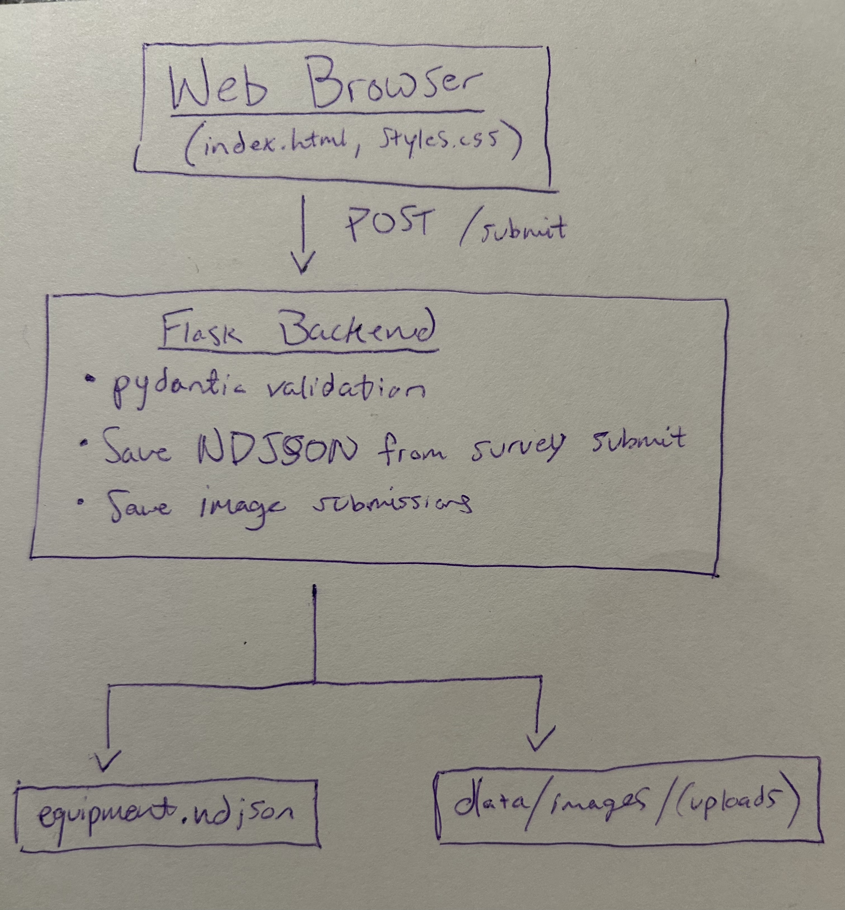
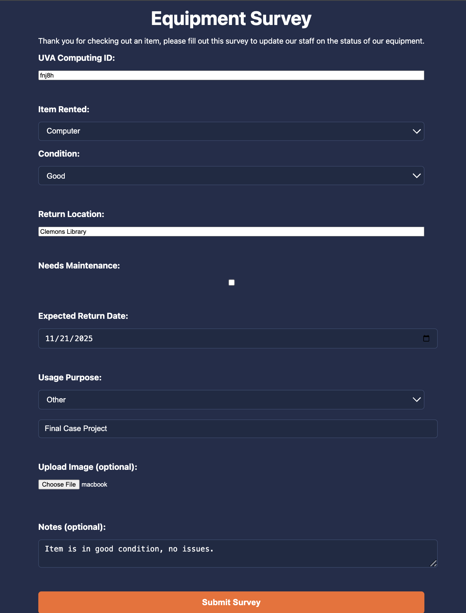

# UVA Equipment Survey — Flask/Docker Application  
*DS 2022 Systems — Final Case Project*
---

## 1) Executive Summary
### **Problem**
At many colleges, including UVA, students borrow laptops, lab gear, and other technical equipment to get through classes, group projects, and research assignments. But once that equipment leaves its original location, its condition becomes a mystery. Staff members often have no clear record of whether a computer was scratched in an all-nighter at Nau Hall, lab equipment dropped on McCormick, or whether a device needs attention before the next student grabs it. Everything is done in different ways, sometimes paper forms, sometimes emails, sometimes verbal check-ins. This inconsistency leads to lost time, miscommunication, and equipment that degrades faster than it should. What is needed is a simple, lightweight way for borrowers to check in and report back, without overwhelming either the students or the staff.

### **Solution**
This project creates a simple, student-friendly form that helps equipment borrowers communicate better with staff. Students can quickly report the condition of the item they used, explain what they used it for, leave notes, and even upload a photo before returning it. All of this information is saved automatically in an organized record that staff can review later, making it much easier to track the status of equipment over time. The whole system runs with one command, so it’s easy for any lab or checkout program to set up without special technical knowledge. It’s a small tool that solves an everyday problem in equipment lending.

---

## 2) System Overview

### **Course Concept(s) Used**
This project directly applies the Flask API case from DS 2022 (case 4), while also implementing information from lectures on Docker. The main course ideas include:

- Basic Flask endpoints for getting and submitting data
- Handling form data and file uploads with Flask to JSON
- Validating inputs with Pydantic models
- Saving submissions to an NDJSON log
- Running everything inside a Docker container for reproducibility
- Using a mounted volume so data is saved on the host machine

## Architecture Diagram
(Stored in `/assets/architecture.png`)


### **Data / Models / Services**
**Flask Backend** | Handles form submissions, image uploads, validation, and NDJSON storage

**Pydantic Model** | Ensures clean, validated survey fields

**NDJSON Storage** | Stored in `data/equipment.ndjson` (one record per line)

**Image Uploads** | Saved to `data/images/` with timestamp filenames

**Frontend** | HTML + CSS Template rendered by Flask

**Docker** | Provides environment for execution

### **Data formats:**
- Survey entries: `.ndjson`
- Images: `.jpg`, `.png`
- License: MIT (see LICENSE file)

---

## 3) How to Run (Local)

This project uses Docker and provides a single-command start via `run.sh`.

### **Prerequisites**
- Docker installed
- Unix shell (Mac/Linux or Git Bash on Windows)

---

### **Option A — One-Command Run**
```bash
# (optional) make run.sh executable if needed
chmod +x run.sh

# Build and run the container
./run.sh
```
This script builds the Docker image and runs the container, mapping port 5000 and mounting the `data/` directory.
### **Option B — Manual Steps**
```bash
docker build -t final-project .
docker run -p 5000:5000 \
  -v "$(pwd)/data:/app/data" \
  final-project
curl http://localhost:5000/ping
```

---

## 4) Design Decisions  
### **Why this concept? (Flask + NDJSON?)**  
Flask is fairly simple, easy to containerize, and ideal for small form applications while also perfectly building off of the concepts from the DS 2022 module on Flask Apps. NDJSON allows submissions to be logged simply with appending the data without needing a full database.

### **Alternatives Considered**
- **MongoDB:** Would require running an additional database container. Unnecessary for a small project.
- **Azure App Service:** A fully managed  platform that could host the Flask app in the cloud. However, it introduces extra setup steps beyond the scope of a this project.

### **Tradeoffs**
- NDJSON is simple but not suitable for large-scale analytics or random access queries.  
- Images stored on disk are convenient locally, but not optimized for public hosting (if multiple staff needed to access the survey).
- Docker adds complexity but ensures environment consistency.
- Flask is lightweight but may not scale well if many users or large amounts of data were submitted.
  
### **Security & Privacy**
- No secrets or credentials stored in the repo  
- `.env.example` included for reproducibility  
- Uploaded filenames with timestamp to avoid collisions
- Pydantic validation to prevent malformed data

### **Ops Considerations**
- Docker ensures that each user's own form submissions persist
  on their local machine, even after the container stops. No data is shared
  between different users or environments. 
- `/images/<filename>` endpoint provides future compatibility with admin dashboards.

---

## 5) Results & Evaluation  

### **Sample Output (NDJSON Entry)**

```json
{
  "equipment_id": "fnj8zh",
  "item_rented": "Computer",
  "condition": "Good",
  "location": "Clemons Library",
  "needs_maintenance": false,
  "return_date": "2025-11-21",
  "usage_purpose": "Final Case Project",
  "notes": "Item is in good condition, no issues.",
  "image_filename": "20251121_154433_macbook.jpg"
}
```
### **Sample Output (Frontend)**


### **Performance**

- p95 request latency: < 50 ms
- Dockerized app starts in under 1 second after build
- NDJSON appends in < 10 ms per submission

### **Validations & Tests**
The repo includes a smoke test (tests/test_smoke.py) to ensure the expected project structure is present.

Run:
``` bash
pytest -q
```

---

## 6) What's Next

Potential future improvements:

- Admin dashboard to browse submission data and preview uploaded images
- SQLite or MongoDB backend for better querying
- Access control for staff
- Deployment to Azure App Service or similar
- Email confirmations on submission
- Automatic maintenance alerts for items in poor condition
- Enhanced frontend with JavaScript validation and better UX
  
---
## 7) Links (Required)
### **GitHub Repo:** <https://github.com/fnj8zh/uva-equipment-survey>
### **Cloud Deployment:** N/A (local Docker app)

## Acknowledgments

This project used ChatGPT (OpenAI) to help with debugging, and documentation editing. All final design and implementation decisions were made by the author.